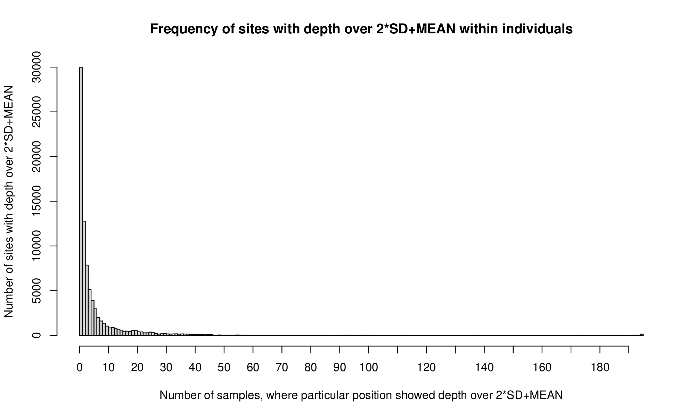

# vcf-mask

### Table of Contents  


[# Excessive Depth Mask](https://github.com/MarekSlenker/vcf-mask#excessive-depth-mask)


[# Fixed Heterozygosity Mask](https://github.com/MarekSlenker/vcf-mask#fixed-heterozygosity-mask)


## Excessive Depth Mask


**input data**: vcf from well-covered samples, with snps and invariants both after GATK filtering (filtered, but not removed), but without insertions, deletions and spanning deletion sites (i.e. the sites with *)


```sh
#load modules (programs)
module add gatk-3.7
module add parallel-20160622
module add r/r-4.1.1-intel-19.0.4-ilb46fy # R version 4.1.1
module add bedops-2.4.39 

```


#### 1) we need a tabular version of VCF with depth columns using the GATK function VariantsToTable.

```sh
REF="/auto/pruhonice1-ibot/shared/brassicaceae/ref/cardamine/pseudohap_Camara_90M_10kb.fasta"


parallel -j 16 --plus "echo {}; java -jar $GATK/GenomeAnalysisTK.jar -T VariantsToTable \
	-R $REF --showFiltered -log {..}.vartable.log \
	-V {} -AMD \
	-o vartable.{..}.tsv \
	-F CHROM -F POS -F QUAL -F QD -F DP -F MQ -F MQRankSum -F ReadPosRankSum -F FS -F HET -F SOR -F FILTER \
	-GF DP" ::: $(ls -S *vcf.gz) 
```

#### 2) merge all vartables
```sh
head -n 1 $(ls -t vartable*.tsv | head -1 ) > summary.variant.table.tsv
grep --no-filename -v "CHROM" vartable*.tsv >> summary.variant.table.tsv
```

#### 3) move to `R` and extracts positions with depth that is higher than 2*SD+MEAN.
```sh
R --vanilla
```
```R
# install all necessary packages
# install.packages('data.table', repos="https://cran.wu.ac.at/")
# library(data.table, lib.loc="/auto/pruhonice1-ibot/home/mslenker/R/Rpacakges-R-4.1.1-intel-19.0.4-ilb46fy")
library('data.table')

# read data
vt = fread("summary.variant.table.tsv" ,sep="\t", header=T, verbose=T)


##function that generates mean + 2*sd depth value for each sample 
sdm<-function(x) {
  x = na.omit(x)
  s = sd(x)
  m = mean(x)
  sd2 = m+2*s
  return(sd2)
}

# get positions with depth over mean + 2*sd (calculated for each sample) for each sample 
exdedsam = data.frame(CHROM=character(), POS=integer(), samples=character())   
for (s in grep(".DP",names(vt),value = T)) { # for each sample
  column = paste("vt$\"", s, "\"", sep = "")  # column="vt$C071A.DP"  # sd  s="C071A.DP"
  eval(parse(text=paste("sd2 = sdm(", column, ")", sep = "")))  # get 2sd+m per each sample, named list is generated by sapply
  cat(s, " sd2: ",sd2, "\n")
  eval(parse(text=paste("pos = vt[", column, "> sd2, c(1,2)]", sep = "")))
  # print(dim(pos)[1])
  # print(pos)
  pos2 = cbind(pos,"samples" = rep(s, dim(pos)[1]))
  #names(pos)
  exdedsam = rbind(exdedsam,pos2)
} 

exc = data.table(exdedsam) 
exCounts = exc[,list(n=length(samples)), by=list(CHROM,POS)] 
summary(exCounts)
write.table(exCounts, "excess_depth_possitions_count.table.tsv", quote=F, sep="\t", row.names=F, col.names=F)


pdf("hist.pdf", width=10, height=6)
hist(exCounts$n, breaks=seq(0,max(exCounts$n),1), xaxt='n', 
     main = "Frequency of sites with depth over 2*SD+MEAN within individuals",
     xlab = "Number of samples, where particular position showed depth over 2*SD+MEAN",
     ylab = "Number of sites with depth over 2*SD+MEAN")
axis(side=1, at=seq(0,max(exCounts$n), 10), labels=seq(0,max(exCounts$n),10))
dev.off()

q()
```
after quiting **`R`**, we will have `excess_depth_possitions_count.table.tsv` file and histogram: 




Majority of sites with excessive depth occures only in one or few individuals, most likely because of sequencing depth variation.
We will incude in mask only sites where **18** and more individuals showed excess depth, to match some more general pattern occurring across a substantial fraction of individuals.  


#### 3. Generate a depth mask based on the `excess_depth_possitions_count.table.tsv` file that is the result of the previous step. 

The following code takes two arguments: COUNTTABLE (`excess_depth_possitions_count.table.tsv`) and the N (`18`), what gives a threshold number of individuals for the site to be marked as excess depth (18 and more). We prefer to use histogram to choose this threshold, see above.  

(continue in shell)
```sh
COUNTTABLE="excess_depth_possitions_count.table.tsv"
N="18"

wc -l $COUNTTABLE


cat $COUNTTABLE | awk -v n="$N" '{if ($3>=n && $1!="NA") {printf "%s\t%s\n", $1, $2  }}' | tee excess_depth_possitions.tmp | tr \\t : > excess_depth_possitions.${N}_indiv.GATK.sites 


awk '{printf "%s\t%d\t%d\n" ,$1,($2 - 1),$2}' excess_depth_possitions.tmp > excess_depth_possitions.${N}_indiv.bed #create bed file   

sort-bed excess_depth_possitions.${N}_indiv.bed > excess_depth_possitions.${N}_indiv.sorted.bed

bedops --ec -m excess_depth_possitions.${N}_indiv.sorted.bed | tee excess_depth_possitions.${N}_indiv.sorted.merged.bed | awk -F'\t' 'BEGIN{SUM=0}{ SUM+=$3-$2 }END{print SUM " sites masked"}'

sed 's/\t/:/' excess_depth_possitions.${N}_indiv.sorted.merged.bed | sed 's/\t/-/' > excess_depth_possitions.${N}_indiv.GATK.intervals 

rm excess_depth_possitions.tmp

```

the `excess_depth_possitions.${N}_indiv.GATK.sites` and `excess_depth_possitions.${N}_indiv.GATK.intervals` are the masking files.


## Fixed Heterozygosity Mask

**input data**: vcf from well-covered **diploid populations**, **biallelic snps** after GATK filtering (filtered, but not removed), without insertions, deletions and spanning deletion sites (i.e. the sites with *)

### 1. Extract genotype fields

Download and installing SnpEff, follow instuctions on [SnpEff download page](https://pcingola.github.io/SnpEff/download/). 
I used SnpEff	4.3t	2017-11-24, available [here](https://sourceforge.net/projects/snpeff/files/snpEff_v4_3t_core.zip/download)

```sh
module add jdk-8
module add parallel-20160622

parallel -j 16 "echo {/}; java -Xmx16g -jar snpEff/SnpSift.jar extractFields {} "CHROM" "POS" "GEN[*].GT" > {}.ann.tab.txt" ::: $(ls -S ./*vcf.gz)

grep --no-filename -v "CHROM" *ann.tab.txt > ann.tab.forHetMask.txt
```


### 2. Generate fixed heterozygosity mask


We decided to **blacklist any gene (exon+intron) with  more than X% fixed heterozygous SNPs in the exon in any of the diploid populations**. But this is really up to you and your study model.  
To do this, we will need to extract gene and exon boundaries from gff file.  

```sh
grep -P "\tgene\t" pseudohap_Camara_90M_10kb.gff > pseudohap_Camara_90M_10kb.genes.gff

grep -P "\texon\t" pseudohap_Camara_90M_10kb.gff > pseudohap_Camara_90M_10kb.exons.gff
```


add R module, and then move to `R`

```sh
module add r/r-4.1.1-intel-19.0.4-ilb46fy # R version 4.1.1

R --vanilla
```

I will split this following `R` code to multiple code blocks, to make it more understandable, but you can make everything at once, in one `R` session.  

First of all, install and load 'data.table' package.
```r
# install.packages('data.table', repos="https://cran.wu.ac.at/")
# install.packages('pbapply', repos="https://cran.wu.ac.at/")
# library(data.table,lib.loc="/auto/pruhonice1-ibot/home/mslenker/R/Rpacakges-R-4.1.1-intel-19.0.4-ilb46fy")

library('data.table')
```

As next, let's set some variables that we will need later:
- names: sample names, get it from vcf file, row "#CHROM ... "
- pop: names of populations, 
- TABLE: ann.tab.forHetMask.txt


```r
# set arguments
names<-c("CHROM","POS","CA064Q","CA064E","CA064G","CA064H","CA064J","CA064A","CA064C","CA068A","CA068B","CA068C","CA068D","CA068E","CA068G","CA068H","CA068I","CA068J","CA085A","CA085B","CA085C","CA085D","CA085E","CA085F","CA085G","CA085H","CA085I","CA085J","CA087A","CA087B","CA087C","CA087D","CA087E","CA087F","CA087G","CA087H","CA087I","CA087J")
pop<-c("CA064","CA068","CA085","CA087")
TABLE="ann.tab.forHetMask.txt"
EXONS="pseudohap_Camara_90M_10kb.exons.gff"
```

Some portion of SNPs is formed from invariant sites, or amount of missing data is above acceptable level, so let's remove all this things.  

```r
# read ann.tab.forHetMask.txt table
a = fread(TABLE,col.names = names)


# we need SNPs only, so we will remove all invariant sites and SNPs with more than 25% missing data as well
isInvariant = function(x){
	invarSites=length(which(x=="0/0"|x=="1/1"|x=="0|0"|x=="1|1"))
	missingSites=length(which(x=="./."))
	allSites=length(x)-2
	remove=(allSites == invarSites+missingSites | (missingSites/allSites)>0.25)  # remove invariant or if contain more tna 25% missing sites
	# if (remove) { cat(as.character(x), "\n")} # DEBUG
	return(remove)
}
invSites = apply(a,1,isInvariant)


# export sites which passed previous filtering step
a_inv=cbind(a, invSites)
a_SNPS = subset(a_inv,a_inv$invSites == FALSE)
write.table(a_SNPS,"a_SNPS.txt",quote=F,row.names=F)
```

  
As stated above, we decided to blacklist any gene (exon+intron) with more than X% fixed heterozygous SNPs in the **exon** in any of the diploid populations. To do this, we need to know boundaries of exons (we will get it from `pseudohap_Camara_90M_10kb.exons.gff` file), and how many SNPs occures in each exon. You can easily edit this code to work with whole genes, if desired.

```r
exons = read.table(EXONS)
exonsOfGenesBoundaries = cbind(exons$V1, exons$V4, exons$V5,  gsub("Parent=", "", gsub("\\.t.*", "", exons$V9, fixed = F))  )

colnames(exonsOfGenesBoundaries) = c("CHROM", "exonBegin", "exonEnd", "GEN")
exonsOfGenesBoundaries = as.data.frame(exonsOfGenesBoundaries)


# calculate lengths of exons
exonsOfGenesBoundaries$length = as.numeric(exonsOfGenesBoundaries$exonEnd) - as.numeric(exonsOfGenesBoundaries$exonBegin) + 1 
exonsOfGenesBoundaries$snpsInExon=NA

# calculate number of SNPs within each exon
for (ch in unique(exonsOfGenesBoundaries$CHROM)){  # split chromosoms to make it faster
	cat(ch, "\n")
	eval(parse(text=paste("exonsOfGenesBoundaries_", ch, "=exonsOfGenesBoundaries[exonsOfGenesBoundaries$CHROM==", ch,", ]", sep="")))
	# check, if there is any SNP
	eval(parse(text=paste("SNPsCount", "= nrow(a_SNPS[a_SNPS$CHROM==", ch,", ])", sep="")))
	
	if (SNPsCount > 0) { # yeap, SNP is there
		eval(parse(text=paste("chrom_", ch, "=a_SNPS[a_SNPS$CHROM==", ch,", ]", sep="")))
		eval(parse(text=paste("snpsInExon = apply(exonsOfGenesBoundaries_", ch, ",1,function(x) sum(chrom_", ch, "$POS %in% as.numeric(x[2]):as.numeric(x[3])))", sep="")))
	} else {
		eval(parse(text=paste("snpsInExon = rep(0, length(exonsOfGenesBoundaries_", ch, "$GEN))", sep="")))
	}
	eval(parse(text=paste("exonsOfGenesBoundaries$snpsInExon[exonsOfGenesBoundaries$CHROM == ", ch,"] = snpsInExon", sep="")))  # push results directly to exonsOfGenesBoundaries$snpsInExon 
}
write.table(exonsOfGenesBoundaries, "exonsOfGenesBoundaries_snpsInExon.txt", quote=F,row.names=F)
```

Another thing we need to know is the number of populations with fixed heterozygosity for each SNP. Following code blocks will do that. SNP positions with fixed heterozygosity within at least one population will be printed to `fixedHetPerSite.txt` file.

```r
# this function calcutates number of homozygots per population. if the number of homozygots == 0, all samples are heterozygous.
popsum=function(p){
	cat(p, "\n")
	colind=grep(p,colnames(a_SNPS)) # get column index of particular population
	numind=length(colind) # get number of individuals per population
	nameind=colnames(a_SNPS)[grep(p,colnames(a_SNPS))] # name of columns
	pt=a[,..nameind] #subset the data.table
	pt=cbind(a[,c(1,2)],pt) # add CHROM and POS and GENE
	
	pt$het=apply(pt=="0/1"|pt=="0|1",1,sum) # how many hets per site   # MK 
	pt$mis=apply(pt=="./.",1,sum) # how many missing per site
	pt$hm=(numind-pt$mis-pt$het) # number of homozygots
	pt$pmis=pt$mis/numind # percentage of missingness
	
	pt=subset(pt,pt$pmis<0.25) # remove sites with high missingness
	pout=pt[,c("CHROM","POS","hm","pmis")] # then we will work only with the number of homozygots and percentage of missingness
	colnames(pout)[c(3,4)] = c(paste(p,"hm",sep=""),paste(p,"pmis",sep=""))
	return(pout)
}

# now run this function per population
popres = lapply(pop,popsum)
#merge the result into one table
poptable = Reduce(merge,popres)
head(poptable)
# dim(poptable)
# sapply(popres,dim)
idhom = grep("hm",colnames(poptable)) # get indices of homozygosity columns
hm = poptable[,..idhom]
poptable$fixhet = apply(hm==0,1,sum)
fixhetpersite = subset(poptable,poptable$fixhet>0)
fixhetpersite = fixhetpersite[,c("CHROM","POS","fixhet")]
write.table(fixhetpersite,"fixedHetPerSite.txt",quote=F,row.names=F)

```

`fixhetpersite` contains SNP positions with fixed heterozygosity within at least one population. To restrict sites to those present in at least 2 populations, subset `fixhetpersite` as in the next block of code.

```R
fixhetpersite = subset(fixhetpersite,fixhetpersite$fixhet > 1)
write.table(fixhetpersite,"fixedHetPerSite.txt", quote=F, row.names=F)
```


now we have:
- exon boundaries and how many SNPs are present in each exon (you can edit it according your needs)
- possitions of fixed SNPs in at least one (or more) population(s)

as next, we will merge this information, = we will count, how many fixed heterozygous SNPs occurs in each exon.


```R
exonsOfGenesBoundaries$fixhet = NA
exonsOfGenesBoundaries$fixhet = apply(exonsOfGenesBoundaries, 1,
		function(x) {
			# cat(x, "\n");
			#                                                                             exonBegin        exonEnd
			nrow((fixhetpersite[fixhetpersite$CHROM==x[1] & fixhetpersite$POS %in% as.numeric(x[2]):as.numeric(x[3]),])) 
			} )

write.table(exonsOfGenesBoundaries,"exonsOfGenesBoundaries_fixedHetPerExon.txt", quote = F, row.names = F)
```

We counted number of fixed heterozygous SNPs per exon, (omitting SNPs in introns) and now let's count number of SNPs (all and fixed heterozygous) per **gene**.

```R
snpsPerGen = aggregate(snpsInExon~GEN, exonsOfGenesBoundaries, sum)
fixhetPerGen = aggregate(fixhet~GEN, exonsOfGenesBoundaries, sum)

write.table(snpsPerGen,"numbOfSnpsPerGen.txt",quote=F,row.names=F)
write.table(fixhetPerGen,"numbOfFixhetSnpsPerGen.txt",quote=F,row.names=F)
```

Portion of fixed heterozygous SNPs out of all SNPs per gene can be represented in percentages and dispalyed as histogram.


```R
# fixhetPerGen = read.delim("numbOfFixhetSnpsPerGen.txt", sep = "")  # rPerExon
# snpsPerGen = read.delim("numbOfSnpsPerGen.txt", sep = "")

fixhet = merge(snpsPerGen, fixhetPerGen, by.x = "GEN", by.y = "GEN")

fixhet$percentages = (fixhet$fixhet/fixhet$snpsInExon)*100
write.table(fixhet, "fixhet.txt",quote=F,row.names=F)


pdf()
hist(fixhet$percentages, breaks = seq(0,100,0.1),
     main = "Portion of fixed heterozygous SNPs out of all SNPs within exons per gene",
     xlab = "% of fixed het sites out of all SNPs")

hist(fixhet$percentages, ylim = c(0,50), xlim=c(0,20), breaks = seq(0,100,0.1), 
     main = "Portion of fixed heterozygous SNPs out of all SNPs within exons per gene",
     xlab = "% of fixed het sites out of all SNPs", xaxt='n')
axis(side=1, at=seq(0,100, 5), labels=seq(0,100,5), lwd.ticks = 3)
axis(side=1, at=seq(0,100, 1), labels = F)

hist(fixhet$percentages, ylim = c(0,25), xlim=c(0,5), breaks = seq(0,100,0.01), 
     main = "Portion of fixed heterozygous SNPs out of all SNPs within exons per gene",
     xlab = "% of fixed het sites out of all SNPs", xaxt='n')
axis(side=1, at=seq(0,100, 1), labels=seq(0,100,1), lwd.ticks = 3)
axis(side=1, at=seq(0,100, 0.1), labels = F)
dev.off()
```


Let's blacklist each gene with more than 3% of fixed heterozygous SNPs.


```R
fixhet = fixhet[!is.na(fixhet$percentages), ] 
toBlacklist = fixhet[fixhet$percentages > 3, ]
write.table(toBlacklist, "toBlacklist_genes_3%fixedHetSitesPerGene.txt",quote=F,row.names=F)
```

List of genes to blacklist is in 'toBlacklist_genes_3%fixedHetSitesPerGene.txt' file.  
Quit the `R` session
```r
q()
```
and finish the mask in `BASH`.


```sh
# BASH code
cut -d ' ' -f 1 "toBlacklist_genes_3%fixedHetSitesPerGene.txt" > genesToBlacklist

grep -w -f genesToBlacklist pseudohap_Camara_90M_10kb.genes.gff > cardamine.fixedHetMask.genesWith3%fixedHetSites.bed

sed -i 's/\([0-9]*\)[a-zA-Z \t]*\([0-9]*\)\t\([0-9]*\).*/\1 \2 \3/' cardamine.fixedHetMask.genesWith3%fixedHetSites.bed

sed 's/ /:/' cardamine.fixedHetMask.genesWith3%fixedHetSites.bed | sed 's/ /-/' > cardamine.fixedHetMask.genesWith3%fixedHetSites.GATK.intervals
```


